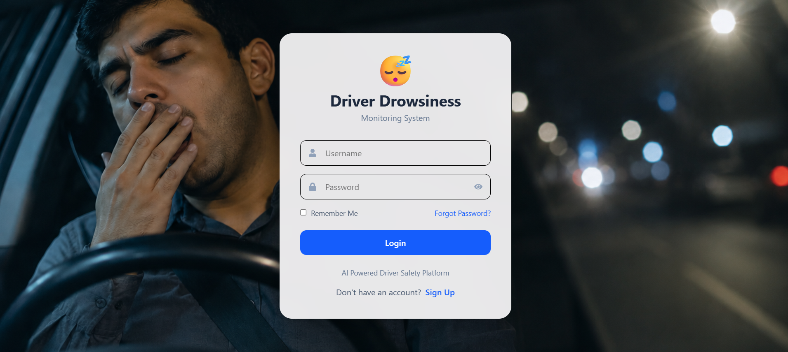
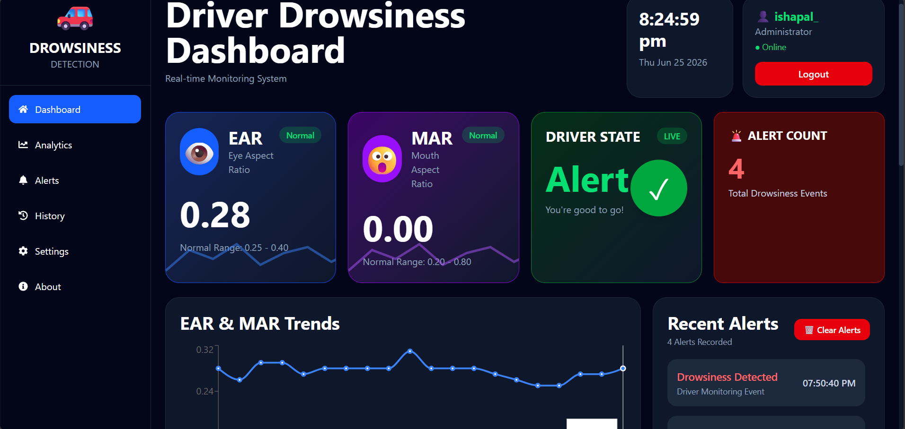
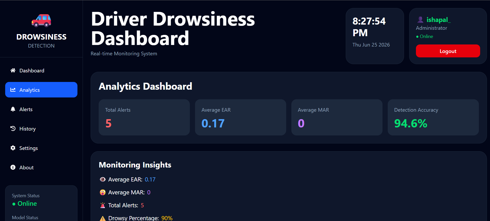
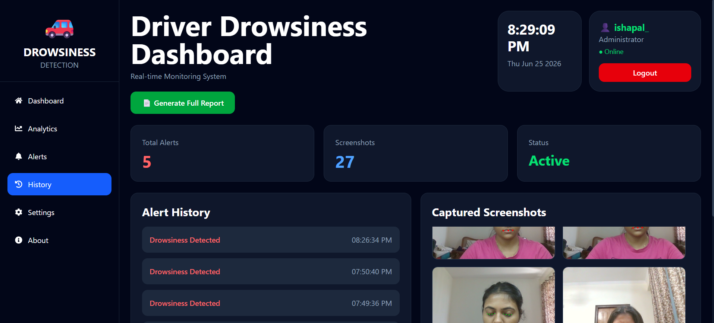
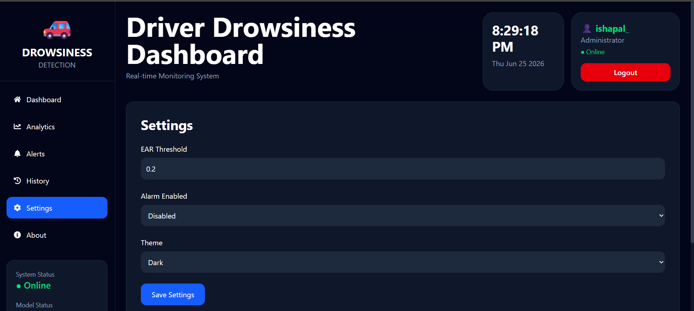

# 🚗 AI Driver Drowsiness Detection System

[](https://driver-drowsiness-frontend-rho.vercel.app)
[](https://driver-drowsiness-backends.onrender.com)
[](https://github.com/Isha4002/DriverDrowsinessSystem)

<div align="center">

### **AI-Powered Real-Time Driver Fatigue Detection using Computer Vision**

A full-stack Driver Drowsiness Detection System that uses **OpenCV**, **MediaPipe FaceMesh**, and **Machine Learning** to detect driver fatigue in real time. The application continuously monitors the driver's eyes and mouth, generates alerts when drowsiness is detected, captures screenshots, maintains analytics, and provides a modern dashboard for monitoring driver safety.

---


</div>

---

# 📌 Project Overview

Driver fatigue is one of the leading causes of road accidents. This project provides a real-time AI-powered monitoring system that continuously tracks eye and mouth movements through a webcam to detect drowsiness.

When signs of fatigue are detected, the system:

* 🚨 Triggers an alert
* 📸 Captures a screenshot
* 📊 Updates dashboard analytics
* 📈 Stores alert history
* 📄 Generates downloadable reports

The project combines Artificial Intelligence, Computer Vision, Full Stack Development, and Cloud Deployment into a single application.

---

# ✨ Features

## 🔐 Authentication

* User Registration
* User Login
* JWT Authentication
* Password Encryption using bcrypt
* MongoDB User Database

---

## 👁 Driver Monitoring

* Real-Time Webcam Monitoring
* Eye Aspect Ratio (EAR)
* Mouth Aspect Ratio (MAR)
* Drowsiness Detection
* Driver Status Monitoring

---

## 📊 Dashboard

* Live Camera Feed
* EAR Monitoring
* MAR Monitoring
* Driver Status Card
* Alert Counter
* Analytics Panel
* History Tracking
* Screenshot Gallery
* Settings Panel

---

## 📈 Analytics

* Average EAR
* Average MAR
* Total Alerts
* Drowsiness Percentage
* Historical Trend Graph

---

## 📄 Reports

* PDF Report Generation
* Latest Screenshot
* Driver Statistics
* Alert Summary

---

## 🌐 Deployment

* Frontend deployed on **Vercel**
* Backend deployed on **Render**
* MongoDB Atlas Database

---

# 🏗️ System Architecture

```text
                     Webcam
                        │
                        ▼
                 OpenCV Camera
                        │
                        ▼
              MediaPipe FaceMesh
                        │
                        ▼
            Eye & Mouth Landmark Detection
                        │
                        ▼
             EAR & MAR Feature Extraction
                        │
                        ▼
            Drowsiness Detection Logic
                        │
         ┌──────────────┴──────────────┐
         ▼                             ▼
 Screenshot Capture             Alert Generation
         │                             │
         └──────────────┬──────────────┘
                        ▼
                   Flask REST API
                        │
          ┌─────────────┴─────────────┐
          ▼                           ▼
     MongoDB Atlas             JSON Storage
          │                           │
          └─────────────┬─────────────┘
                        ▼
               React Dashboard
```

---

# 🛠️ Tech Stack

## Frontend

* React.js
* Tailwind CSS
* Axios
* Chart.js
* React Icons

## Backend

* Flask
* Flask-CORS
* JWT Authentication
* bcrypt
* Python

## Computer Vision

* OpenCV
* MediaPipe FaceMesh
* NumPy
* Machine Learning

## Database

* MongoDB Atlas

## Deployment

* Vercel
* Render

---

# 📂 Folder Structure

```text
Driver-Drowsiness-System/

│
├── backend/
│   ├── api.py
│   ├── app.py
│   ├── detector.py
│   ├── alarm.py
│   ├── alert_logger.py
│   ├── db.py
│   ├── model.pkl
│   ├── screenshots/
│   ├── alerts.json
│   ├── history.json
│   ├── status.json
│   ├── settings.json
│   ├── requirements.txt
│   └── .env
│
├── frontend/
│   ├── src/
│   ├── public/
│   ├── package.json
│   ├── vite.config.js
│   └── .env
│
├── images/
│   ├── login.png
│   ├── register.png
│   ├── dashboard.png
│   ├── analytics.png
│   ├── history.png
│   ├── gallery.png
│   └── settings.png
│
└── README.md
```

---

# 🚀 Installation

## Clone Repository

```bash
git clone https://github.com/Isha4002/Driver-Drowsiness-System.git

cd Driver-Drowsiness-System
```

---

## Backend Setup

```bash
cd backend

python -m venv venv

venv\Scripts\activate

pip install -r requirements.txt
```

Create a `.env` file:

```env
MONGO_URI=YOUR_MONGODB_URI
SECRET_KEY=YOUR_SECRET_KEY
```

Run Backend API

```bash
python api.py
```

Run Detection Engine

```bash
python app.py
```

---

## Frontend Setup

```bash
cd frontend

npm install

npm run dev
```

---

# 📷 Project Screenshots


## 🔐 Login Page

<p align="center">
  
</p>

---

## 📝 Registration Page

<p align="center">
  
</p>

---

## 📊 Dashboard

<p align="center">
  
</p>

---

## 📈 Analytics

<p align="center">
  
</p>

---

## 📜 History

<p align="center">
  
</p>

---


## ⚙️ Settings

<p align="center">
  
</p>

# 📡 REST API Endpoints

| Method | Endpoint       | Description          |
| ------ | -------------- | -------------------- |
| GET    | `/status`      | Live Driver Status   |
| GET    | `/alerts`      | Alert History        |
| GET    | `/analytics`   | Analytics Data       |
| GET    | `/history`     | EAR/MAR History      |
| GET    | `/screenshots` | Screenshot List      |
| GET    | `/stats`       | Dashboard Statistics |
| POST   | `/register`    | Register User        |
| POST   | `/login`       | User Login           |
| POST   | `/settings`    | Save Settings        |

---

# 🔒 Security Features

* JWT Authentication
* Password Hashing using bcrypt
* MongoDB Atlas Database
* Environment Variables
* CORS Enabled Backend

---

# 💡 Future Scope

* Multi-User Driver Monitoring
* Cloud Screenshot Storage
* Mobile Application
* Email Alert Notifications
* Driver Face Recognition
* GPS Integration
* AI Behaviour Analysis
* Driver Performance Reports
* Cloud-Based Live Monitoring

---

# 📈 Learning Outcomes

During this project, the following technologies and concepts were implemented:

* Full Stack Web Development
* REST API Development
* JWT Authentication
* MongoDB Integration
* Computer Vision using OpenCV
* Face Landmark Detection
* MediaPipe FaceMesh
* Machine Learning Integration
* Dashboard Development
* Cloud Deployment using Render & Vercel

---

# 👩‍💻 Developer

**Isha Pal**

**B.Tech – Information Technology**

GitHub: https://github.com/Isha4002

LinkedIn: *(Add your LinkedIn Profile)*

Email: *(Add your Email Address)*

---

# ⭐ Show Your Support

If you found this project useful, please consider giving it a ⭐ on GitHub.

It helps others discover the project and supports future development.

---

## 📄 License

This project is developed for educational and learning purposes.
